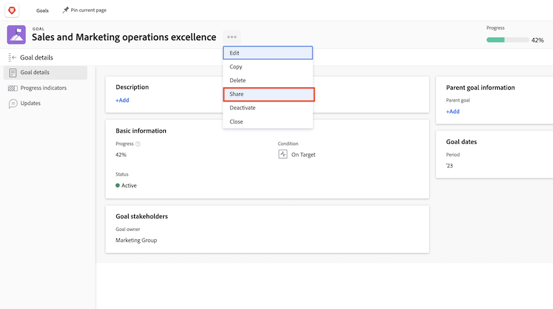

# Kommunicera målstatus

Nu när du har uppdaterat dina mål med hjälp av kan du ta ett ögonblick tillbaka och få en fågelperspektiv på de mål du arbetar med och hur de hänger ihop med teamet, gruppen och företagets mål. Att kommunicera med andra om hur era mål utvecklas och utvecklas är en viktig del av att hålla er uppdaterade.

Det finns olika sätt att hålla rätt personer uppdaterade om era mål. Du kan börja med:

* Dela och rapportera om era mål
* Utnyttja [!UICONTROL Diagram] för att få en heltäckande bild av hur era mål fortskrider

## Dela ett mål

Du kan dela ett mål som du har skapat eller ett mål som har skapats av någon annan som du har behörighet att hantera. Du kan inte dela mål med grupper, team eller företag. Om du har behörigheten Hantera för ett mål kan du ändra målets behörigheter för målskaparen. Som standard har den person som skapar målet behörigheten Hantera, men du kan ändra dem till Visa.

1. Klicka på målets namn för att dela det från ett avsnitt i [!DNL Goals] området som ska öppnas [!UICONTROL Målinformation] -panelen.

1. Klicka på ikonen med tre punkter bredvid målnamnet och klicka sedan på [!UICONTROL **Dela**]. The [!UICONTROL Målåtkomst] visas.

   

1. Gör något av följande:

   * Välj [!UICONTROL Hantera hela systemet] ställa in för att ge behörighet att hantera till alla i systemet som har behörighet att redigera till [!DNL Goals] genom [!DNL Workfront] åtkomstnivå. Detta är som standard avmarkerat för alla nya mål.
   * Börja skriva namnet på en användare som du vill ge [!UICONTROL Hantera] behörigheter i [!UICONTROL Ge Hantera åtkomst till] box. Markera namnet när det visas i listan.

1. Klicka [!UICONTROL **Dela**]. En systemomfattande etikett eller namnen på de användare som har behörigheten Hantera för målet visas i [!UICONTROL Åtkomst till Hantera] i [!UICONTROL Målinformation] -panelen.

## Rapport om målinformation

Du kan skapa målrapporter eller projektrapporter som innehåller information om associerade mål i [!DNL Workfront]. Det finns flera sätt att visa målinformation i rapporter.

* Skapa en målrapport i området Rapporter. Du kan visa olika information om målet i målrapporten (till exempel: namn, ägare, datum, förlopp osv.) som innehåller följande:

   * **Målhierarki**—Visar alla överordnade mål och hur de kopplas till varandra.
   * **Är företagsmål**- Anger om din organisation har utsetts till ägare av ett mål.
   * **Ägartyp**- Anger om ägaren till ett mål är en användare, ett team eller en grupp.

* Skapa en projektrapport som visar målinformation, inklusive följande:
   * **Målhierarki**—Visar alla överordnade mål och hur de kopplas till varandra.
   * **Mål**- Det här är ett samlingsfält som visar alla mål som är kopplade till ett projekt.
   * **Antal länkade mål**—Antalet mål som är associerade med projektet.
