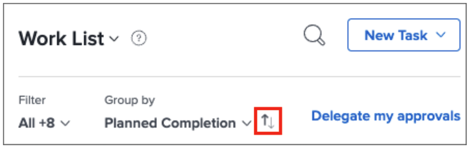

# Organisera din att göra-lista i [!DNL Workfront] [!UICONTROL Hem]

>[!NOTE]
>
>Alternativet [!UICONTROL [!DNL Sort by]] i [!UICONTROL arbetslistan] har bytt namn till [!UICONTROL Gruppera efter], och aktiviteter och ärenden kan också grupperas efter deras [!UICONTROL planerade startdatum].

I den här videon får du lära dig att:

* Sortera arbetstilldelningar
* Filtrera arbetstilldelningar efter typ
* Identifiera arbeten som är klara att starta
* Acceptera arbetstilldelningar

>[!VIDEO](https://video.tv.adobe.com/v/335099/?quality=12&learn=on&enablevpops)

>[!NOTE]
>
>Som standard visas tidigaste förfallna objekt högst upp i [!UICONTROL arbetslistan]. Om du vill att dina arbetsobjekt ska visas i fallande ordning klickar du på pilarna till höger om grupperingsområdet.

