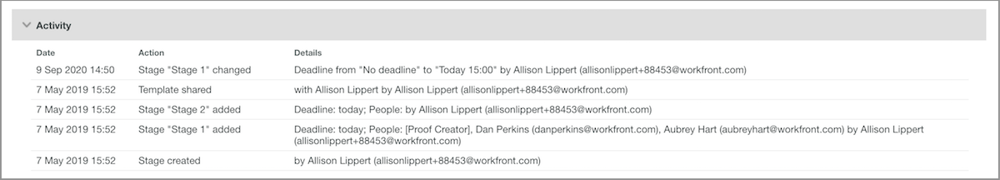

# Redigera en automatiserad arbetsflödesmall

I takt med att gransknings- och godkännandeprocesserna förfinas eller organisatoriska förändringar görs bör automatiserade arbetsflödesmallar uppdateras för att återspegla den aktuella verksamheten för era team med Workfront.

Genom att hålla mallarna uppdaterade får du en konsekvent gransknings- och godkännandeprocess, och dessutom sparar du tid för dem som laddar upp korrektur eftersom de inte behöver ändra något arbetsflöde hela tiden.

1. Välj **[!UICONTROL Korrektur]** på **[!UICONTROL Huvudmenyn]** i [!DNL Workfront].
1. Välj **[!UICONTROL Arbetsflöden]** på den vänstra panelmenyn.
1. Klicka på menyn med tre punkter längst till höger om mallnamnet och välj **[!UICONTROL Visa mallinformation]**.

Alternativ för att dela, kopiera och ta bort mallen finns längst upp i mallinformationsfönstret för varje mall. Om du tar bort en mall påverkas inte korrektur som använder mallen, men det betyder att mallen inte längre är tillgänglig.

<!--
Lean More URLs
-->

Klicka på pilen för att utöka avsnittet [!UICONTROL Detaljer] för att ändra saker som mallnamnet eller mallens tidszon.

## Gör ändringar i stadier och mottagare

Det kan behövas ändringar i [!UICONTROL arbetsflödesområdet] när en smidig process innebär en tidigare deadline eller när någon går med i teamet och kommer att granska korrektur.

Varje steg i ett automatiserat arbetsflöde har ett eget avsnitt där du kan ändra deadlines, sekretess, korrekturmottagare och annan information oberoende av varandra.

I den här videon visas några av de ändringar du kan göra i området [!UICONTROL Arbetsflöde] kort. Se punktlistan under den här videon som visar dessa inställningar. Det finns inget ljud i den här videon.

>[!VIDEO](https://video.tv.adobe.com/v/335131/?quality=12&learn=on)

Här är korrekturmallsändringarna som du kan göra i avsnittet [!UICONTROL Arbetsflöde]:

* Klicka i fältet [!UICONTROL scennamn] eller fältet [!UICONTROL deadline] för att uppdatera informationen.
* Välj pilen bredvid [!UICONTROL deadline] om du vill låsa scenen, avgöra när scenen är aktiverad eller endast kräva ett beslut.
* Klicka i fältet [!UICONTROL Roll] eller [!UICONTROL E-postaviseringar] i mottagarlistan för att välja ett annat alternativ.
* Gå till menyn med tre punkter längst till höger om namnet på en mottagare om du vill ta bort dem från listan, göra dem till den primära beslutsfattaren för arbetsflödessteget eller redigera korrekturrollen och e-postaviseringsinformationen.
* Du har två alternativ för att lägga till mottagare i listan. När du har öppnat fönstret [!UICONTROL Lägg till personer på scenen] klickar du på vilken scen de ska läggas till i. Ange sedan deras namn eller e-postadress i mottagarlistan och tilldela en korrekturroll och en e-postavisering. Klicka på knappen [!UICONTROL Lägg till personer] när du är klar.
   1. I det övre högra hörnet av varje scenavsnitt går du till menyn [!UICONTROL Mer] och väljer [!UICONTROL Lägg till personer på scenen].
   1. Överst i [!UICONTROL arbetsflödesområdet] väljer du [!UICONTROL Lägg till personer på scenen].

## Malldelning

Under [!UICONTROL Delad med] visas korrekturanvändare som kan använda mallen. Ta bort personer som inte längre behöver använda mallen genom att klicka på menyn med tre punkter längst till höger om namnet och välja [!UICONTROL Ta bort].

![[!UICONTROL Delad med ]-lista](assets/proof-system-setups-edit-template-shared-with.png)

Du kan dock inte lägga till personer i delningslistan från det här avsnittet. Det gör du genom att gå tillbaka till det övre delen av mallinformationsfönstret och klicka på knappen [!UICONTROL Dela mall] .

## Aktivitetsavsnittet

[!DNL Workfront] sparar en granskningshistorik över när ändringar gjordes i mallen. Du kan se datumet, vem som gjorde ändringen och en del kortfattad information om vilka ändringar som gjordes.

I det här avsnittet registreras ingen information om när mallen användes på korrektur.

