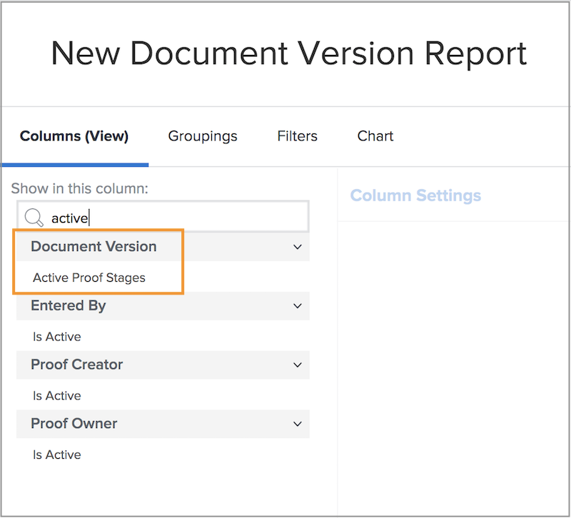

# Rapport om korrektur

[!DNL Workfront]Tack vare de digitala korrekturfunktionerna kan du hantera projekt och arbetsflöden för granskning på ett och samma ställe - [!DNL Workfront]. Få värdefulla insikter i det korrekturrundarbete som görs med rapporttyper, fältkällor och fältnamn som visar gransknings- och godkännandeinformation.

Vi rekommenderar att du arbetar med [!DNL Workfront] för att skapa rapporter som uppfyller organisationens krav. Vissa rapporter kräver att man känner till [!DNL Workfront]Textlägesrapportering.

Börja med dessa enkla standardrapporter som hjälper era team att hantera korrektur som genomgår en gransknings- och godkännandeprocess i [!DNL Workfront].

## [!UICONTROL Bevis godkännande]

Den här rapporttypen hjälper dig att spåra utestående korrekturgodkännanden för att säkerställa att deadlines hålls.

![Välj [!UICONTROL Bevis godkännande] från [!UICONTROL Ny rapport] nedrullningsbar meny](assets/proof-system-setups-proof-approval-report.png)

Visa och filtrera [!UICONTROL beslutsdag], [!UICONTROL godkännande av bevis], [!UICONTROL godkännarfas], [!UICONTROL arbetsflödesmall]och [!UICONTROL begärandeinformation]. Med textlägesrapportering kan du skapa en gruppering som ordnar listan efter dokumentnamn. Se [Grundläggande textläge för grupperingar](https://experienceleague.adobe.com/docs/workfront-learn/tutorials-workfront/reporting/intermediate-reporting/basic-text-mode-for-groupings.html?lang=en).

När du skriver korrekturrapporter för godkännande ska du se till att du får information om den senaste versionen av korrektur. [!DNL Workfront] rekommenderar att du tar med fältkällan och fältnamnet i filtret:

**[!UICONTROL Bevis godkännande]>>[!UICONTROL Är aktuell dokumentversion]**

Detta är användbart när du rapporterar korrektur som har flera versioner, så rapporten innehåller endast den aktuella versionen av varje korrektur som behöver godkännas. Det filtrerar bort tidigare versioner som du inte längre behöver arbeta med.

## [!UICONTROL Dokumentversion]

Med den här rapporttypen kan du hantera och spåra versioner i [!DNL Workfront].

![Välj [!UICONTROL Dokumentversion] från [!UICONTROL Ny rapport] nedrullningsbar meny](assets/proof-system-setups-document-version-report.png)

Visningsalternativen innehåller information från [!UICONTROL dokumentversion], [!UICONTROL dokument], [!UICONTROL anges av], [!UICONTROL status för godkännande av bevis], [!UICONTROL korrekturläsare]och [!UICONTROL dokumentleverantör].

Grupperingar kan göras av [!UICONTROL dokumentversion], [!UICONTROL anges av], [!UICONTROL status för godkännande av bevis]eller korrekturinformation om ägare.

Filtren innehåller [!UICONTROL dokumentversion], [!UICONTROL åtkomstnivå], [!UICONTROL dokument], [!UICONTROL anges av], [!UICONTROL status för godkännande av bevis], [!UICONTROL korrekturläsare]och dokumentleverantörsinformation.

Du kan visa namnet på den korrekturfas som är aktiv för varje dokument i rapporten med den här kolumnen i en vy:

**[!UICONTROL Dokumentversioner] >> [!UICONTROL Aktiva korrekturstadier]**

Om ingen scen är aktiv är kolumnen tom.

Fältnamnet >> är också tillgängligt som ett filter i en rapport.

Använd [!UICONTROL Korrekturskapare] fältkälla för att rapportera information om användaren som skapade korrekturet. Välj [!UICONTROL Namn] fältkälla för att visa namnet på den som har skapat korrekturet i en vy.

**[!UICONTROL Korrekturskapare] >> [!UICONTROL Namn]**

Den här fältkällan >> fältnamnskombinationen är också tillgänglig som ett filter.

<!--
Learn More Icon
Learn how to create reports in [!DNL Workfront] with the Report Creation class.
Access to proofing functionality
-->
