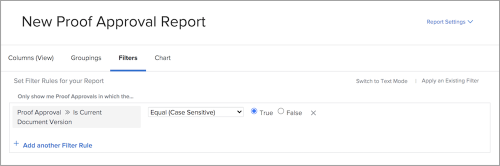

# Rapport om korrektur

Med de digitala korrekturfunktionerna i [!DNL Workfront] kan du hantera projekt och relaterade granskningsarbetsflöden på ett och samma ställe - [!DNL Workfront]. Få värdefulla insikter i det korrekturrundarbete som görs med rapporttyper, fältkällor och fältnamn som visar gransknings- och godkännandeinformation.

Vi rekommenderar att du samarbetar med din [!DNL Workfront]-konsult för att skapa rapporter som uppfyller organisationens krav. Vissa rapporter kräver att du känner till textlägesrapporteringen för [!DNL Workfront].

Börja med dessa grundläggande standardrapporter som hjälper ditt team att hantera korrektur som genomgår en gransknings- och godkännandeprocess i [!DNL Workfront].

## [!UICONTROL Korrekturgodkännande]

Den här rapporttypen hjälper dig att spåra utestående korrekturgodkännanden för att säkerställa att deadlines hålls.

![Välj [!UICONTROL Korrekturgodkännande] i listrutan [!UICONTROL Ny rapport]](assets/proof-system-setups-proof-approval-report.png)

Vy- och filteralternativen omfattar [!UICONTROL beslutsdatum], [!UICONTROL korrektur av godkännande], [!UICONTROL godkännarfas], [!UICONTROL arbetsflödesmall] och [!UICONTROL information om begärande]. Med textlägesrapportering kan du skapa en gruppering som ordnar listan efter dokumentnamn. Se [Förstå grundläggande textläge för grupperingar](https://experienceleague.adobe.com/docs/workfront-learn/tutorials-workfront/reporting/intermediate-reporting/basic-text-mode-for-groupings.html?lang=en).

När du skriver korrekturrapporter för godkännande ska du se till att du får information om den senaste versionen av korrektur. [!DNL Workfront] rekommenderar att du inkluderar den här fältkällan och fältnamnet i filtret:

**[!UICONTROL Korrektur för godkännande]>[!UICONTROL Är den aktuella dokumentversionen]**

Detta är användbart när du rapporterar korrektur som har flera versioner, så rapporten innehåller endast den aktuella versionen av varje korrektur som behöver godkännas. Det filtrerar bort tidigare versioner som du inte längre behöver arbeta med.

## [!UICONTROL Dokumentversion]

Med den här rapporttypen kan du hantera och spåra versioner i [!DNL Workfront].

![Välj [!UICONTROL Dokumentversion] i listrutan [!UICONTROL Ny rapport]](assets/proof-system-setups-document-version-report.png)

Visningsalternativen innehåller information från [!UICONTROL dokumentversion], [!UICONTROL dokument], [!UICONTROL som anges av], [!UICONTROL dokumentets godkännandestatus], [!UICONTROL korrekturläsare] och [!UICONTROL dokumentleverantör].

Grupperingar kan utföras av [!UICONTROL dokumentversion], [!UICONTROL som anges av &#x200B;], [!UICONTROL bevis för godkännandestatus] eller korrekturägarinformation.

Filtren innehåller [!UICONTROL dokumentversion], [!UICONTROL åtkomstnivå], [!UICONTROL dokument], [!UICONTROL som anges av &#x200B;], [!UICONTROL bevis för godkännandestatus], [!UICONTROL korrekturskapare] och information om dokumentleverantör.

Du kan visa namnet på den korrekturfas som är aktiv för varje dokument i rapporten med den här kolumnen i en vy:

**[!UICONTROL Dokumentversioner] >> [!UICONTROL Aktiva korrektursteg]**

Om ingen scen är aktiv är kolumnen tom.

Fältnamnet >> är också tillgängligt som ett filter i en rapport.

Använd fältkällan [!UICONTROL Korrekturskapare] för att rapportera information om användaren som skapade korrekturet. Välj fältkällan [!UICONTROL Namn] om du vill visa namnet på den som skapade korrekturet i en vy.

**[!UICONTROL Korrekturskapare] >> [!UICONTROL Namn]**

Den här fältkällan >> är också tillgänglig som ett filter.

<!--
Learn More Icon
Learn how to create reports in [!DNL Workfront] with the Report Creation class.
Access to proofing functionality
-->
