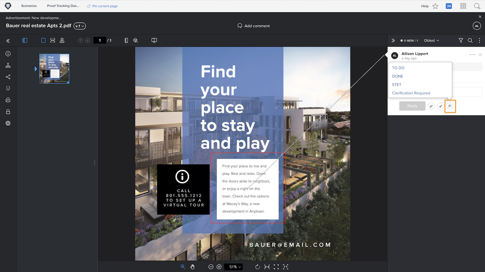

# Hantera korrekturkommentarer

[!DNL Workfront] hjälper dig att spåra och hantera arbete som rör varje kommentar i ett korrektur, till exempel att korrigera resursen, med kommentarsåtgärder eller genom att lösa kommentarer.

Korrekturåtgärder är en&quot;flagga&quot; eller&quot;etikett&quot; på en kommentar och används ofta för att ange att en åtgärd har vidtagits eller behöver vidtas med avseende på kommentaren. Funktionsmakron kan väljas från ikonen eller menyn Mer för varje kommentar.

Du ansvarar t.ex. för att avgöra vilken av de korrigeringar som ska göras under granskningsprocessen som faktiskt ska utföras. Med en åtgärd kan du markera relevanta kommentarer och låta en designer eller redigerare veta vilka ändringar som ska göras. Den personen kan sedan använda en annan åtgärd för att ange att ändringarna har gjorts.

![En bild av ett korrektur i korrekturläsaren med korrekturåtgärden [!UICONTROL &#x200B; Att göra] markerad i kommentaren.](assets/manage-comments-2.png)

Om du inte ser åtgärder som listas i dina kommentarer har din organisation inte konfigurerat dem. Tala med din korrektursystemadministratör om du tycker att åtgärder är något som din organisation ska använda.

Funktionen&quot;lösa kommentar&quot; används ofta för att ange att en kommentar har behandlats på något sätt - en korrigering har gjorts eller en fråga har besvarats. Vissa [!DNL Workfront]-kunder&quot;löser&quot; en kommentar när det är en korrigering som inte behöver göras eller bara är en kommentar som har lästs.

Lös kommentaren genom att klicka på bockmarkeringsikonen. Det här placerar en grön bock på kommentaren, vilket gör det enkelt att identifiera vilka kommentarer som har granskats när du skannar genom kommentarskolumnen.

Du kan filtrera kommentarskolumnen efter båda dessa funktioner, vilket gör att du kan strukturera vad du ser när du arbetar med korrekturet.

![En bild av kommentarfiltren i korrekturläsaren med filtreringsalternativen [!UICONTROL Åtgärder] och [!UICONTROL Allmänt] markerade.](assets/manage-comments-3.png)

## Din tur

>[!IMPORTANT]
>
>Glöm inte att påminna medarbetare som har tilldelats ett korrekturarbetsflöde om att du arbetar med korrektur som en del av din Workfront-utbildning.

1. Hitta ett bevis som du har överfört i Workfront. Öppna korrekturläsaren för att titta på kommentarer som har gjorts och svara på en kommentar. Stäng korrekturläsaren när du är klar.
1. Använd uppdateringsavsnittet, antingen i dokumentinformationen eller på sammanfattningspanelen, för att visa de senaste kommentarerna på ett korrektur som du har överfört till Workfront. Svara på en kommentar.

<!--
## Learn more
* Create and manage proof comments
-->
