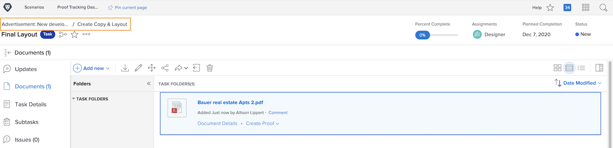

# Förstå korrekturinformation

## Visa korrekturinformation

Som korrekturhanterare eller ägare kan du fördjupa dig i detaljerna bakom ett korrektur via sammanfattningspanelen och sidan [!UICONTROL Dokumentinformation]. Börja med att hitta ditt korrektur i avsnittet [!UICONTROL Dokument] i ett projekt, en uppgift eller ett problem.

### Panelen Sammanfattning

Välj ett korrektur i dokumentlistan och klicka sedan på ikonen Sammanfattning i skärmens övre högra hörn.

![En bild av avsnittet [!UICONTROL Dokument] i ett projekt där ett korrektur har valts.](assets/document-summary-1.png)

Klicka sedan på Översikt för att expandera översiktsavsnittet.

![En bild av avsnittet [!UICONTROL Dokument] i ett projekt där ett korrektur är valt och sammanfattningspanelen utökad. Både ikonen för sammanfattningspanelen och sammanfattningspanelen är markerade.](assets/document-summary-2.png)

Bläddra sedan nedåt till avsnittet Korrektur. Här ser du korrekturens ägare, förlopp, antal kommentarer, status och förfallodatum.

![En bild av avsnittet [!UICONTROL Dokument] i ett projekt där ett korrektur är valt och sammanfattningspanelen utökad. Både ikonen för sammanfattningspanelen och sammanfattningspanelen är markerade.](assets/document-summary-3.png)

Obs! Avsnittet [!UICONTROL Godkännanden] på sammanfattningspanelen är för **dokument**-godkännanden och **är inte** knutet till korrekturgranskning och godkännandeprocess. De två processerna är separata i [!DNL Workfront].

### [!UICONTROL Dokumentinformation]

Om du vill ha mer information om korrekturet klickar du på [!UICONTROL Dokumentinformation].

![En bild av avsnittet [!UICONTROL Dokument] i ett projekt där ett korrektur är markerat och [!UICONTROL Dokumentinformation] är markerat.](assets/document-summary-4.png)

Då kommer du till sidan [!UICONTROL Dokumentinformation] och en mängd andra alternativ i den vänstra panelen.

![En bild av korrekturets sida i [!DNL &#x200B; Workfront].](assets/document-details.png)

Det är viktigt att komma ihåg att möjligheten att se information om korrekturläsningen beror på dina korrekturbehörigheter i [!DNL Workfront].

På korrektursidan kommer du åt dessa avsnitt från den vänstra panelmenyn:

* **Uppdateringar -** Kommentarer gjorda i korrekturläsaren visas här, med taggen &quot;korrekturkommentar&quot;. Du kan också kommentera filen, precis som du gör kommentarer för en uppgift eller ett projekt (dessa kommentarer visas inte i korrekturläsaren).
* **Godkännanden -** Det här avsnittet gäller för dokumentgodkännanden, inte för korrektur av godkännanden. De två typerna av godkännanden är separata processer i [!DNL Workfront] och länkar inte samman. Om du använder korrekturarbetsflöden för granskningar och godkännanden kommer du inte att använda det här avsnittet.
* **Alla versioner -** Spåra och hantera versionshistoriken för korrekturet. Det kan vara enklare att komma åt informationen i sammanfattningspanelen i listan [!UICONTROL Dokument].
* **Anpassade Forms -** Anpassade formulär används för korrektur för att samla in organisationsspecifik information. Den här informationen kan skickas med filen till integrerade dokumentlagringssystem, som [!DNL Workfront] DAM eller Adobe Experience Manager. Anpassade formulär konfigureras av [!DNL Workfront]-systemadministratören eller gruppadministratören. Tala med teamet eller administratörerna för att ta reda på om ni kommer att använda anpassade formulär i korrektur.
* **Korrektur -** Hantera eller ändra det arbetsflöde som tilldelats korrekturet. Du kan öppna det här fönstret med länken [!UICONTROL Korrektur] på korrekturet i listan [!UICONTROL Dokument] också.

Vi tittar närmare på två av avsnitten: [!UICONTROL Språkkontroll för visningsprogram] och [!UICONTROL Språkkontroll].

### [!UICONTROL Inställningar för korrekturläsare]

Med de här inställningarna kan du styra åtkomsten till själva korrekturet.

![En bild av [!UICONTROL inställningarna för korrektur av visningsprogram] från korrektursidan med alternativet [!UICONTROL Inställningar för språkkontroll] markerat på den vänstra panelmenyn.](assets/proofing-settings-on-details-page.png)

* **[!UICONTROL Kräv inloggning. Det går inte att dela det här korrekturet med gästanvändare &#x200B;] —** Beviset kan bara delas med personer som har en [!DNL Workfront]-korrekturlicens.
* **[!UICONTROL Kräv att beslut ska signeras elektroniskt] —** När du delar ett bevis kräver detta att mottagaren har språkbehörighet i [!DNL Workfront] och att de&quot;signerar&quot; korrekturläsaren elektroniskt genom att ange sitt korrekturlösenord när de fattar ett beslut om korrektur. (Obs! Språklösenordet skiljer sig från ditt [!DNL Workfront]-lösenord. Språklösenordet är inte lätt att komma åt, så de flesta mottagare känner inte till lösenordet.) Adobe rekommenderar att du pratar med din [!DNL Workfront]-konsult innan du använder den här funktionen.
* **[!UICONTROL Lås korrektur när alla nödvändiga beslut fattas]—** Detta låser beviset till eventuella ytterligare kommentarer, svar, beslut osv. när varje beslut om beviset har fattats. Då låses hela korrekturversionen, inte bara ett visst steg i korrekturarbetsflödet.
* **[!UICONTROL Tillåt hämtning av originalfilen] —** Korrekturmottagare kan hämta originalkällfilen för korrekturet från korrekturläsaren.
* **[!UICONTROL Tillåt delning av korrektur via offentlig URL eller inbäddningskod] —** Korrekturmottagare kan dela en offentligt tillgänglig korrekturlänk med vem som helst.
* **[!UICONTROL Tillåt prenumeration på bevis via offentlig URL eller inbäddningskod] —** Alla som skickas den offentliga URL:en kan lägga till sig själva till korrekturet med sin e-postadress och sitt namn (om det inte är en korrekturanvändare) eller sin e-postadress och sitt korrekturlösenord (om det är en korrekturanvändare). (Obs! Språklösenordet är inte detsamma som ett [!DNL Workfront]-lösenord.)

### [!UICONTROL Språkkontroll]

På den här sidan spåras all aktivitet som har inträffat på korrekturet, plus e-postmeddelanden som skickades angående det här korrekturet.

![En bild av avsnittet [!UICONTROL Korrekturaktivitet] på korrektursidan med alternativet [!UICONTROL Korrekturaktivitet] markerat på den vänstra panelmenyn.](assets/proofing-activity-in-details.png)

Avsnittets **[!UICONTROL Aktivitet]** tidsstämplar när kommentarer och beslut gjordes, plus vem som gjorde dem. Den spårar också när korrekturarbetsflödesfaser startas, när en mottagare först öppnade ett korrektur och annan information som en korrekturansvarig eller ägare vill veta. Den här informationen kan vara användbar när du försöker komma på saker som varför en korrekturarbetsflödesfas aldrig startats, till exempel.

Avsnittets **[!UICONTROL Meddelanden]** tidsstämplar när e-postaviseringar och meddelanden skickades till mottagare, som skickade dem och meddelandets innehåll. Detta kan vara användbart vid felsökning om någon säger att de inte fått något e-postmeddelande om ett korrektur. Du kan kontrollera om och när ett e-postmeddelande har skickats.

Adobe rekommenderar att korrekturläsaren och korrekturläsaren bekanta sig med informationen i dessa två avsnitt. När du kombinerar den här informationen med förståelse för hur du läser förloppsindikatorn för [!UICONTROL SOCD] kan du verkligen förstå och hantera dina korrektur, oavsett var de befinner sig i korrekturarbetsflödet.

När du är klar med arbetet i avsnittet [!UICONTROL Dokumentinformation] kan du använda spårningsdata för att gå tillbaka till avsnittet [!UICONTROL Dokument] i projektet, aktiviteten eller skicka korrekturet.

<!--
#### Learn more
* [!UICONTROL Document details] overview
* Add a custom form to a document
* Request document approvals
* Summary for documents overview
* View activity on a proof within [!DNL Workfront]
-->
