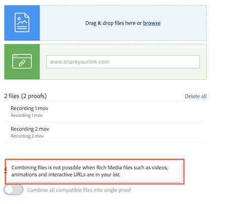

# Kombinera flera filer till ett enda korrektur

Att kombinera flera filer till ett enda korrektur kan ofta göra korrekturläsningen smidigare.

Alternativet&quot;kombinera&quot; är användbart när enskilda filer är relaterade till eller en del av en hel slutprodukt och alla filer måste granskas av samma personer inom samma tidsgräns.

Det kreativa teamet har till exempel utformat ett häfte. Fyra formgivare producerade sidorna och sparade dem som PDF. Om respektive designer laddat upp dessa som individuella korrektur har granskarna fyra separata korrektur att granska. Dessutom skulle det vara svårare att se till att häftet passar ihop.

Lösning - få en person att ladda upp hela PDF och kombinera dem till ett enda korrektur vid överföringen. På så sätt kan granskarna se hela häftet i stället för delar som inte är kopplade till varandra.

Så här kombinerar du korrektur:

1. Öppna avsnittet [!UICONTROL Dokument] i projektet, aktiviteten eller utfärda korrekturet som ska bifogas.
2. Dra och släpp filerna i överföringsområdet eller bläddra till dem. [!DNL Workfront] har stöd för att kombinera upp till 50 filer.
3. Aktivera alternativet [!UICONTROL Kombinera alla kompatibla filer till ett enda korrektur].
4. Ange ett namn för det kombinerade korrekturet. Detta är obligatoriskt.
5. Om du vill kan du ändra ordningen som filerna kombineras med dra och släpp i överföringslistan.
6. Lägg till korrekturmottagare, ange en deadline osv.
7. Klicka på [!UICONTROL Skapa korrektur] för att slutföra överföringen.

![En bild av fönstret [!UICONTROL Nytt korrektur] med den överförda fillistan och [!UICONTROL Enkelt korrektur] markerade.](assets/combine-proofs.png)

När korrekturet har överförts visas det som en ZIP-fil på fliken [!UICONTROL Dokument].

Inget annat krävs för att visa den kombinerade filen. Klicka bara på [!UICONTROL Öppna korrektur] som vanligt så öppnas korrekturet i korrekturläsaren.

## Vad gäller för att kombinera videofiler?

Det går inte att kombinera filer när det finns multimediefiler som videoklipp, animeringar och interaktiva URL:er i listan.

## Din tur

>[!IMPORTANT]
>
>Glöm inte att påminna dina kollegor om att du skickar ett bevis till dem som en del av din Workfront-utbildning.

Sök efter tre eller fyra filer (PDF, textfil osv.) på datorn.

1. Öppna ett projekt, en uppgift eller ett problem som du använder för övningar i Workfront.
1. Ladda upp filerna och kombinera dem till ett enda korrektur.
1. Justera filernas ordning genom att flytta den sista i listan så att den blir den första i listan.
1. Tilldela valfritt arbetsflöde (grundläggande eller automatiserad) och slutför överföringen.

<!--
##Learn more
* Create a multi-page proof
-->
