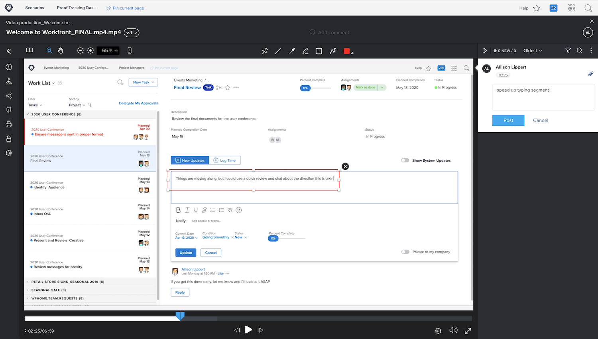

# Överföra ett videoklipp

[!DNL Workfront’s] korrekturfunktioner är inte bara för statiska filer som PDF, kalkylblad eller bilder. [!DNL Workfront] stöder fler än 150 filtyper, inklusive video- och webbhämtningar som är upp till 4 GB stora.

Kom ihåg att det tar längre tid att överföra större filer. Kontrollera att din internetanslutning är stabil innan du påbörjar en stor överföring, eftersom ett avbrott kan avsluta överföringsprocessen.

<!-- For a complete list of uploadable file types, see the article, Supported proofing file types. -->

[!DNL Workfront’s] korrekturläsare är den idealiska platsen för granskning och godkännande av videofiler. Korrekturmottagare kan spela upp videon direkt i korrekturläsaren. Kommentarerna är tidsstämplade, så du vet exakt vilken del av videon kommentaren refererar till. Korrekturmottagare kan till och med använda markeringsverktygen och rita direkt på den pausade videon.

Bland de videotyper som stöds finns MOV, MP4 och H.264. <!-- Check the supported file types list to make sure the video type you use is compatible with Workfront’s proofing features.-->

När du överför en video i [!DNL Workfront] följer du samma steg som när du överför en statisk fil.

* Öppna projektet, aktiviteten eller utgåvan som videon ska överföras till.
* Välj [!UICONTROL **Dokument**] på den vänstra panelmenyn.
* Välj [!UICONTROL **Korrektur**] från knappen [!UICONTROL **Lägg till nytt**].
* Dra och släpp videofilen till överföringsområdet eller använd bläddringsfunktionen.
* Tilldela ett grundläggande eller automatiserat arbetsflöde.
* Ange en deadline.
* Klicka på [!UICONTROL **Skapa korrektur**] för att slutföra.

## Din tur

>[!IMPORTANT]
>
>Glöm inte att informera dina kollegor om att du skickar in ett bevis som en del av din Workfront-utbildning.

Om du har en videofil tillgänglig kan du överföra den till ett övningsprojekt, en uppgift eller ett problem i Workfront. Använd ett grundläggande eller automatiserat arbetsflöde som liknar det du normalt använder - eller använd det faktiska arbetsflödet, om du redan vet vad det är.

