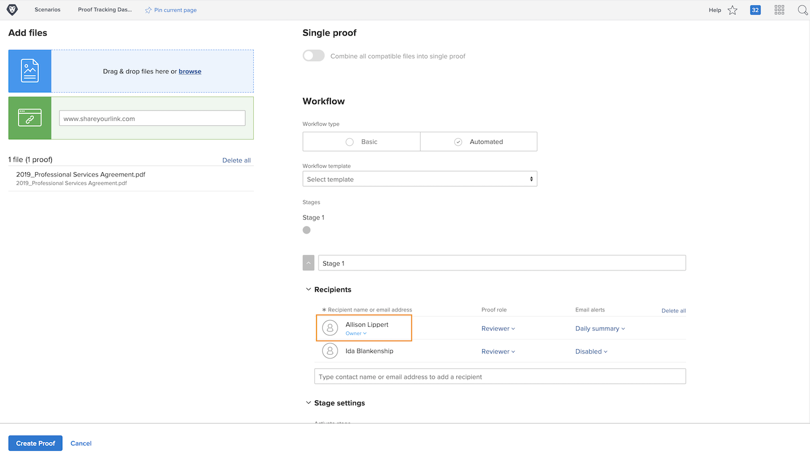

# Överföra ett korrektur med ett automatiserat arbetsflöde

I den här videon får du lära dig:

* När ett automatiserat korrekturarbetsflöde kan användas
* Tillämpa ett arbetsflöde med en korrekturmall
* Så här skapar du ett automatiskt arbetsflöde från grunden

>[!VIDEO](https://video.tv.adobe.com/v/3453013/?quality=12&learn=on&enablevpops=1&captions=swe)

## Ytterligare inställningar för korrekturarbetsflöde

Inställningarna längst ned i fönstret för korrekturöverföring är valfria, så fråga din organisation om och hur du använder dem.

![En bild av fönstret [!UICONTROL Nytt korrektur]med [!UICONTROL sceninställningarna] markerade.](assets/additional-proof-workflow-settings.png)

* **[!UICONTROL Lås fas] —** Detta förhindrar att personer i det här arbetsflödessteget kan kommentera eller ändra beslut efter att de har slutfört sitt arbetsflöde.
* **[!UICONTROL Överför primära beslutsrättigheter till &#x200B;] —** Snabba upp korrekturprocessen genom att utse en primär beslutsfattare. När det är inställt tolkar [!DNL Workfront] den här personens bevisbeslut som beslutet. När personen väl har fattat sitt beslut är skedet över och inga andra beslut behövs.
* **[!UICONTROL Kräv endast ett beslut för det här steget] —** Ett annat sätt att effektivisera korrekturläsningen är att bara kräva ett beslut för korrekturet. När detta är aktiverat, oavsett hur många godkännare ni har i det skedet, är det här steget färdigt när någon av dem har fattat ett beslut.
* **[!UICONTROL Gör det här steget privat] —** Som standard är kommentarer om korrektur synliga för alla i alla faser. Förhindra att mottagare av korrektur i andra stadier ser kommentarer som gjorts under det här steget genom att klicka i rutan.

Längst ned i korrekturuppladdningsfönstret finns flera korrekturinställningar som påverkar säkerheten för ditt korrektur, t.ex. ett krav på inloggning för att visa korrekturet.

<!--
Learn more about these in the Proof settings section of the Configure a proof article.
-->

![En bild av avsnittet [!UICONTROL Korrekturinställningar] i korrekturöverföringsfönstret.](assets/additional-proof-workflow-settings-2.png)

<!--
### Learn more
* Automated workflow overview
* Automated workflow stages overview
-->

<!--
### Guides
* Plan an advanced workflow worksheet
-->

## Varför är du med i korrekturarbetsflödet?

Du står med på listan över mottagare av korrektur eftersom det är du som överför korrekturet. Detta gör dig också korrekturläsare, vilket ger dig redigeringsbehörighet över korrekturet, så att du kan ändra arbetsflödesinställningarna eller överföra en ny version, bland annat.

Om du bara överför korrekturet, men någon annan kommer att hantera arbetsflödet, kan du ändra korrekturens ägare genom att klicka på länken [!UICONTROL Ägare] och ange deras namn. Detta rekommenderas om någon annan än den ursprungliga överföraren kommer att överföra en version.

## Din tur

>[!IMPORTANT]
>
>Glöm inte att påminna dina kollegor om att du skickar in ett bevis som en del av din Workfront-utbildning.

Överför ett korrektur med ett avancerat arbetsflöde. Om din organisation redan har korrekturmallar väljer du den som används av ditt team och gör sedan några justeringar.

* Justera e-postvarningarna så att ingen får meddelande om när en aktivitet sker på korrekturet.
* Den första fasen ska ha två granskare/godkännare.
* Den andra fasen ska endast ha en granskare/godkännare.

Om din organisation inte har några korrekturmallar än skapar du ett arbetsflöde i två steg.

* Tilldela dig själv och din favoritkollega till det första steget.
* Gör deadline för första steget en dag från när korrekturet skapas.
* Tilldela en annan favoritmedarbetare till den andra fasen.
* Få scenen att lyfta när den första scenens deadline har passerats.
* Ge personen i det här skedet två dagar på sig att slutföra granskningen, men det måste vara klart vid lunchtid.

